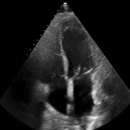
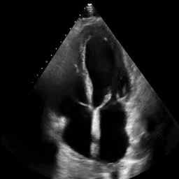
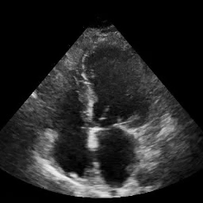
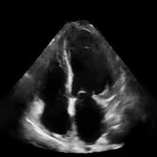
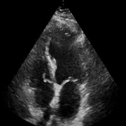
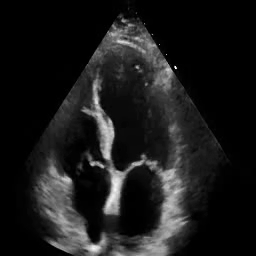

Enhancing Echocardiogram Video Quality via Latent Space Editing 
--------------------------------------------------------------
## Examples 

|Sonographer-Labeled Low Quality | Enhanced Version           |
|------------------------------  |----------------            |
|  |  |
|  |  |
|  |  |

## Inference
1. Download model weights from release. Create a directory named
   `pretrained_models` in the `pivotal_tuning_inversion` directory. Then, insert
   model weights into this folder.
   
2. Navigate to the directory `pivotal_tuning_inversion`
```
cd pivotal_tuning_inversion
```
3. Apply pivotal tuning inversion for echocardiogram videos (.mp4)
```
python TUNE_MODEL.py --source_dir [...] --experiments_dir [...]
```

- `--source_dir` specifies path to directory containing A4C echocardiogram videos
- `--experiments_dir` specifies path to directory to store outputs
4. Apply latent space editing for echocardiogram videos
```
python EDIT_VIDEOS.py --experiments_dir [...]
```
- `--experiments_dir` specifies path to directory of stored outputs

### Experiments Directory Structure

```bash
.
├── <example_video_uid>
│    ├── embeddings
│    │   ├── <example_video_uid>_F0.pt
│    │   └── ...
│    ├── frames
│    │   ├── <example_video_uid>_F0.png
│    │   └── ...
│    ├── PAIRED_SYNTHETIC_TRAJECTORY
│    │   ├── <example_video_uid>_0.1_.mp4
│    │   └── ...
│    ├── pivot_tuned_G.pt
│    ├── reconstructed_video.mp4
│    └── video.mp4
│
└── ...
```
Each sub-directory in the experiments directory corresponds to inference results for a specific video. Each sub-directory contains:
- `embeddings`: sub-directory containining latent embeddings for frames (.pt) 
- `frames`: sub-directory containing extracted frames (.png) 
- `PAIRED_SYNTHETIC_TRAJECTORY`: sub-directory containing edited videos w/ varying edit levels (.mp4)
- `pivot_tuned_G.pt`: weights of pivot-tuned generator  
- `reconstructed_video.mp4`: reconstructed video from latent embeddings in pivot-tuned generator 
- `video.mp4`: original video 

### Video Formatting Requirements
The following are required for videos: 
- grayscale (single-channel) 
- dimensions [256, 256]  (w/ cv2.resize)
- 30 fps 
- no burnt-in annotations 
- 32 frames

## Expected Runtime
PTI takes approximately 1hr 10min for a single A4C echocardiogram video w/ 32 frames on an Nvidia A6000 GPU.

## Acknowledgements
This code borrows heavily from [e4e](https://github.com/omertov/encoder4editing), [PTI](https://github.com/danielroich/PTI), and [StyleGAN2](https://github.com/NVlabs/stylegan2-ada-pytorch)
