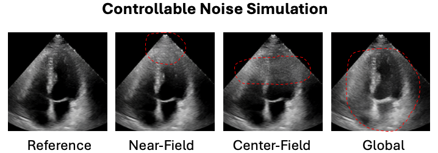
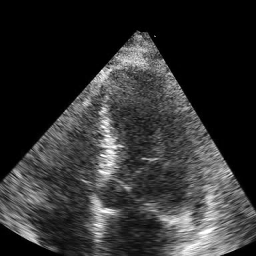
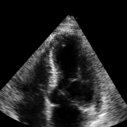
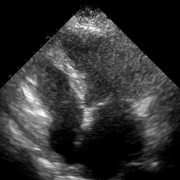
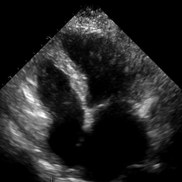
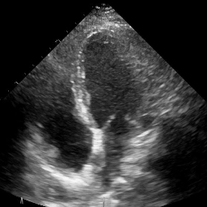
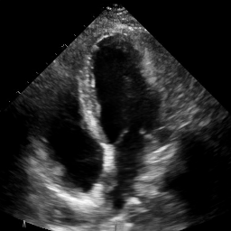

# EchoNet-Quality: Denoising Echocardiograms via Deep Generative Modeling of Ultrasound Noise

## Noise Simulation


## Image Denoising
| Physician-Labeled Noisy           | Denoised                            |
|--------------------------------- |------------------------------------    |
|  |  |
|  |  |
|  |  |


## Inference
1. Download model weights from release.

2. For denoising, run the following command:
```
python3 denoise.py --unet [...] --input [...] --output [...]
```
- `unet`: path to pretrained weights for U-Net (.pt)
- `input`: path to folder containing noisy A4C echo images (.png)
- `output`: path to folder that will store denoised A4C echo images (.png)

3. For noise simulation, run the following command:
```
python3 simulate_noise.py --gan [...] --encoder [...] --input [...] --output [...] --global [...] --center_field [...] --near_field [...]
```
- `gan`: path to pretrained weights for StyleGAN (.pkl)
- `encoder`: path to pretrained weights for Encoder4Editing (.pt)
- `input`: path to file containing a clean A4C echo image (.png)
- `output`: path to folder that will store noise simulation results (.png)
- `global`: integer that controls the extent of global noise
- `center_field`: integer that controls the extent of center-field noise
- `near_field`: integer that controls the extent near-field noise

## Acknowledgements
This repository builds upon [StyleGAN2](https://github.com/NVlabs/stylegan2-ada-pytorch) and [e4e](https://github.com/omertov/encoder4editing).
